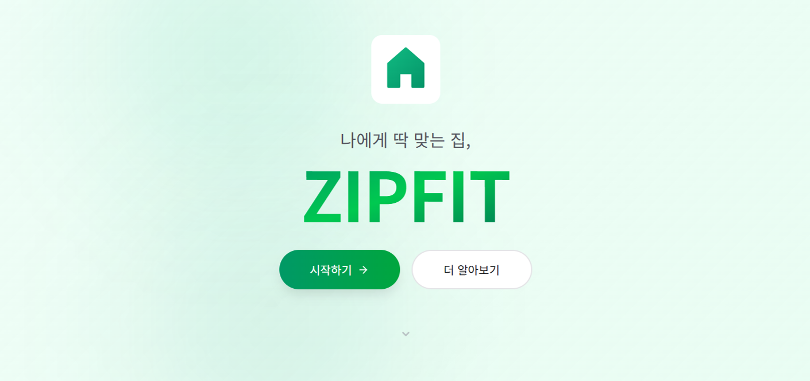

# ZIPFIT (집핏) - 나에게 딱 맞는 집

**SK네트웍스 Family AI 캠프 19기 4차 프로젝트**

> LLM과 RAG 기술을 활용한 공공주택 공고 기반 맞춤형 주거 정보 제공 AI 에이전트 서비스



**상세 문서**: [프로젝트 산출물](./docs/산출물/00_프로젝트_산출물.md)

---

## 1. 팀 소개

**팀명**: A.J.C (Advanced Joint documents Converter)

**팀원**:

|  |  |  |  |  |
|:---:|:---:|:---:|:---:|:---:|
| **김범섭** | **김종민** | **오흥재** | **이상혁** | **이인재** |
| [](https://github.com/WhatSupYap) | [](https://github.com/jongminkim-KR1) | [](https://github.com/vfxpedia) | [](https://github.com/sangpiri) | [](https://github.com/distecter) |

---

## 2. 프로젝트 개요

### (1) 프로젝트 명
ZIPFIT (집핏) - 나에게 딱 맞는 집

### (2) 프로젝트 소개
ZIPFIT은 LH(한국토지주택공사) 공고를 중심으로, LLM과 RAG 기술을 활용해 사용자 맞춤형 주거 정보를 제공하는 AI 에이전트 서비스입니다.

복잡하고 이해하기 어려운 공공주택 공고문을 분석하여, 사용자의 조건에 맞는 공고를 추천하고, 공고 정보를 쉽게 이해할 수 있도록 안내합니다.

**현재 프로토타입 범위**:
- **데이터 범위**: LH 공고만 대상
- **핵심 기능**:
  - **AI 상담**: LangGraph 기반 챗봇을 통한 자연어 대화 인터페이스
  - **공고 비교/추천**: AI 상담 내에서 여러 공고를 비교하고 사용자에게 맞는 공고 추천
  - **신청 안내**: AI 상담 내에서 공고 신청 방법 및 절차 안내
  - **공고 목록**: 별도 페이지에서 공고 목록 조회 및 필터링

### (3) 프로젝트 필요성 (배경)

#### 현재 공공주택 정보 접근의 문제점

공공주택은 청년, 신혼부부, 저소득층 등 주거 취약계층에게 매우 중요한 주거 안정 수단입니다. 그러나 현재 공공주택을 구하려는 사용자는 다음과 같은 어려움을 겪고 있습니다:

| 문제점 | 설명 |
|--------|------|
| **분산된 청약 시스템** | LH, SH, 지방공사 등 사업자마다 별도의 청약 사이트를 운영하여, 여러 사이트를 직접 방문해야 함 |
| **난해한 공고문** | "선계약후검증", "묵시적갱신" 등 전문 용어가 많고, 수십 페이지 PDF를 직접 해석해야 함 |
| **복잡한 자격 요건** | 소득·자산·거주 요건이 공고 유형마다 달라 본인의 신청 자격 판단이 어려움 |

이러한 문제로 인해 많은 사람들이 자신에게 적합한 공공주택 기회를 놓치거나, 부적격 신청으로 시간을 낭비하고 있습니다.

#### 정부의 대응: 대기자 통합시스템 "하나로" 추진


국토교통부도 이러한 문제를 인식하고, **2027년 본격 가동**을 목표로 **공공임대주택 대기자 통합시스템, 하나로**를 추진하고 있습니다. (2025년 1월 공공주택 특별법 개정안 통과)

이는 기존에 LH, SH 등 사업자별로 분산 운영되던 청약시스템을 하나로 일원화하여, 개인 자격 정보 기반으로 신청 가능한 임대주택을 한눈에 확인할 수 있게 하려는 것입니다.

**→ 정부 차원에서도 통합 시스템을 추진할 만큼, 이에 대한 수요가 실제로 존재함.**

#### ZIPFIT의 역할

ZIPFIT은 통합시스템이 가동되기 전인 현재, **AI 기반으로 이 문제를 선제적으로 해결**합니다:

- **LLM + RAG 기술**로 복잡한 공고문을 분석하여 쉽게 설명
- **자연어 대화**로 사용자 조건에 맞는 공고 검색 및 비교
- 여러 사이트를 돌아다닐 필요 없이 **한 곳에서 공고 정보 확인**

나아가 통합시스템 구축 이후에도 **AI 상담 기능**을 통해 사용자가 복잡한 공고 내용을 쉽게 이해하고 자신에게 맞는 공고를 찾을 수 있도록 지원할 수 있습니다.

### (4) 프로젝트 목표

1. **LLM 기반 비정형 문서 이해**: 공공주택 공고문의 맥락을 이해하고, 사용자의 질문에 맞춰 필요한 정보를 추출하여 쉽게 설명합니다.

2. **사용자 맞춤형 정보 제공**: 사용자의 나이, 소득, 가족 구성 등을 고려하여 맞춤형 공고를 추천하고, 자격 요건을 자동으로 확인합니다.

3. **원스톱 서비스 제공**: 공고 검색부터 비교, 추천, 신청 안내까지 AI 상담을 통해 처리할 수 있도록 지원합니다.

4. **사회적 가치 실현**: 모든 국민이 공평하게 공공주택 정보에 접근하고, 자신에게 맞는 주거 기회를 찾을 수 있도록 지원함으로써 주거 불평등 해소에 기여합니다.

---

## 3. 개선사항 (3차 → 4차 프로젝트)

3차 프로젝트 대비 4차 프로젝트에서 개선된 데이터 처리 파이프라인입니다.

### 3-1 PDF 파싱 개선

| 항목 | 3차 프로젝트 | 4차 프로젝트 | 개선 효과 |
|------|-------------|-------------|----------|
| **파싱 엔진** | PyMuPDF4LLM (단일) | LlamaParse + Camelot (하이브리드) | 테이블 추출 정확도 향상 |
| **테이블 처리** | 마크다운 변환만 | Camelot 정확도 검증 (70% 이상만 사용) | 저품질 테이블 필터링 |
| **헤더 처리** | 단순 첫 행 사용 | 다중 헤더 행 자동 감지 및 병합 | 복잡한 공고문 테이블 호환 |
| **문자 정제** | 미처리 | NUL 문자 및 특수문자 자동 제거 | 데이터 품질 향상 |
| **테이블 품질 검증** | 모든 테이블 무조건 사용 | Camelot 정확도 70% 미만 테이블 필터링 | 저품질 테이블로 인한 검색 오류 방지 |
| **페이지 정보** | 미추적 | 페이지 번호별 요소 관리 | 출처 추적 및 디버깅 용이 |

### 3-2 청킹 개선

| 항목 | 3차 프로젝트 | 4차 프로젝트 | 개선 효과 |
|------|-------------|-------------|----------|
| **청크 구조** | 단순 섹션 기반 | 요소 타입별 분리 (text/table/heading) | 검색 정확도 향상 |
| **테이블 청킹** | 고정 크기 분할 | 헤더 유지 + 행 단위 분할 | 테이블 맥락 보존 |
| **컨텍스트 추출** | 섹션명만 사용 | 이전 요소에서 제목/단지명 자동 추출 | 검색 시 맥락 정보 활용 |
| **토큰 계산** | 문자 길이 기반 | 한글 특화 토큰 추정 (단어 + 한글/2) | 한국어 문서 최적화 |
| **테이블 전처리** | 미처리 | 셀 텍스트 정규화 (줄바꿈/공백 제거) | "공급\n형별" → "공급형별" |
| **청크 유효성 검사** | 단어 5개 이상만 체크 | 무의미 패턴 정규식 필터링 (페이지 번호, 구분선 등) | 노이즈 청크 제거 |
| **문장 단위 분할** | 미지원 (고정 크기) | 문장 경계 유지 분할 (`_split_by_sentences`) | 문맥 단절 방지 |
| **HTML 태그 처리** | 미처리 | `<br>` 태그 자동 제거 | PDF 변환 잔여물 정리 |

### 3-3 임베딩 개선

| 항목 | 3차 프로젝트 | 4차 프로젝트 | 개선 효과 |
|------|-------------|-------------|----------|
| **임베딩 모델** | BAAI/bge-m3 (로컬, 1024차원) | OpenAI text-embedding-3-small (1536차원) | API 기반 안정성 + 고차원 표현 |
| **배치 처리** | SentenceTransformer 내장 | LangChain OpenAIEmbeddings | 프레임워크 통합 |
| **싱글톤 패턴** | 미적용 | 모델 인스턴스 재사용 | 메모리 효율성 |

### 3-4 테이블 전처리 신규 기능

4차 프로젝트에서 새롭게 추가된 테이블 전처리 모듈:

```python
# 정규화 규칙 예시
CELL_NORMALIZE_RULES = [
    (r'([가-힣])\n([가-힣])', r'\1\2', '한글 사이 줄바꿈 제거'),  # 공급\n형별 → 공급형별
    (r'([가-힣])\s([가-힣])', r'\1\2', '한글 사이 공백 제거'),    # 양 주 옥 정 → 양주옥정
    (r'([가-힣])\s+(\d)', r'\1\2', '한글-숫자 사이 공백 제거'),   # 옥정 3 → 옥정3
]
```

- **깨진 테이블 행 병합**: PDF 추출 시 발생하는 행 분리 오류 자동 수정
- **확장 가능한 규칙 시스템**: `TablePreprocessor` 클래스로 규칙 동적 추가/제거 가능
- **컬럼별 규칙 적용**: 특정 컬럼에만 추가 규칙 적용 가능

### 3-5 챗봇 아키텍처 개선 (Linear → LangGraph)

#### 3차 프로젝트의 문제점

| 문제점 | 설명 | 영향 |
|--------|------|------|
| **선형 파이프라인** | 질문 → 재구성 → 검색 → 답변 순서로만 처리 | 복잡한 대화 흐름 처리 불가 |
| **맥락 분석 오버헤드** | 매 질문마다 LLM으로 맥락 분석 (3회 호출) | 응답 지연, API 비용 증가 |
| **상태 관리 부재** | 선택된 공고, 검색 결과 등 상태 비영속 | "1번 공고 자세히" 처리 불가 |
| **단일 의도 처리** | 검색 또는 대화만 가능 | 비교, 선택 등 다양한 의도 미지원 |

#### 4차 프로젝트 개선 (LangGraph 기반)

```
[3차: 선형 파이프라인]
질문 → 맥락분석(LLM) → 재구성(LLM) → 멀티쿼리(LLM) → 검색 → Rerank → 답변(LLM)
       ↓ (4~5회 LLM 호출, 맥락 유실)

[4차: LangGraph 상태 그래프]
질문 → 의도분류(1회) → [search|select|detail|compare|chat] → 응답생성
            ↓
       상태(State) 유지: prev_anncs, selected_annc, search_history
```

| 항목 | 3차 프로젝트 | 4차 프로젝트 | 개선 효과 |
|------|-------------|-------------|----------|
| **아키텍처** | 선형 파이프라인 (async 함수 체인) | LangGraph StateGraph (노드 기반) | 복잡한 대화 흐름 지원 |
| **의도 분류** | 맥락 분석 후 2가지 분기 (신규/참조) | 5가지 의도 분류 (search/select/detail/compare/chat) | 다양한 사용자 의도 처리 |
| **상태 관리** | history 배열에 텍스트만 저장 | GraphState에 구조화된 상태 (prev_anncs, selected_annc, search_history) | 공고 선택, 비교 기능 구현 |
| **LLM 호출** | 질문당 4~5회 (맥락+재구성+멀티쿼리+답변) | 질문당 2~3회 (의도분류+검색/응답) | API 비용 절감 |
| **Reranker** | Cross-Encoder 사용 (HuggingFace 로컬 모델) | 제거 (RDB 필터 + 벡터 검색으로 대체) | 응답 시간 20초 → 3~5초 |
| **공고 선택** | 미지원 ("1번 공고" 인식 불가) | 번호/공고명 기반 선택 지원 | "1번 선택", "나주이창 자세히" 처리 |
| **공고 비교** | 미지원 | 2개 이상 공고 비교 분석 | "1번이랑 2번 비교해줘" 처리 |
| **검색 모드** | 항상 신규 검색 | new/add/restore 모드 지원 | "경기도도 추가해줘", "아까 검색 결과" 처리 |

#### LangGraph 그래프 구조

```
                    ┌─────────────────────────────────────┐
                    │         classify_intent             │
                    │   (5가지 의도 분류 + 상태 보정)           │
                    └──────────────┬──────────────────────┘
                                   │
         ┌─────────┬───────┬───────┴──────┬──────────┐
         ▼         ▼       ▼              ▼          ▼
    ┌─────────┐ ┌──────┐ ┌────────┐ ┌──────────┐ ┌────────┐
    │ search  │ │select│ │ detail │ │ compare  │ │  chat  │
    │ (RDB+   │ │      │ │(RAG    │ │(다중공고   │ │  (일반/ │
    │  RAG)   │ │      │ │ 검색)   │ │  비교)    │ │  웹검색) │
    └────┬────┘ └──┬───┘ └───┬────┘ └────┬─────┘ └───┬────┘
         │         │         │           │           │
         ▼         ▼         ▼           ▼           ▼
    ┌─────────────────────────────────────────────────────┐
    │              응답 생성 (generate_*_response)          │
    └─────────────────────────────────────────────────────┘
```

#### 상태 기반 대화 예시

```
사용자: "전라도 행복주택 알려줘"
→ intent: search
→ prev_anncs: [나주이창, 완주삼봉] 저장

사용자: "1번 선택"
→ intent: select (prev_anncs 참조)
→ selected_annc: 나주이창 저장

사용자: "신청자격 알려줘"
→ intent: detail (selected_annc 참조)
→ 나주이창 공고의 RAG 검색 수행

사용자: "1번이랑 2번 비교해줘"
→ intent: compare (prev_anncs 참조)
→ 나주이창, 완주삼봉 비교 분석
```

---

## 4. 시스템 구성도

자세한 내용은 [시스템 구성도 문서](./docs/산출물/04_시스템_구성도.md)를 참조하세요.

### 4-1 전체 시스템 아키텍처


**요청 처리 흐름:**
```
[사용자] → [Nginx] → [Gunicorn] → [Django]
                                      ├── Web (VIEW): HTML 렌더링
                                      └── Chatbot (REST API)
                                            ├── DB Handler → PostgreSQL
                                            ├── CHAT Handler → LangGraph
                                            └── LLM Handler → OpenAI API
```

| 구성요소 | 역할 |
|----------|------|
| **Nginx** | 리버스 프록시, HTTPS 처리, 정적 파일 서빙 |
| **Gunicorn** | WSGI 서버, Django 앱 실행 |
| **Django** | 웹 프레임워크, 비즈니스 로직 처리 |
| **DB Handler** | 공고 데이터 CRUD (PostgreSQL) |
| **CHAT Handler** | LangGraph 기반 대화 처리 |
| **LLM Handler** | OpenAI API 호출 (GPT-4o-mini) |

### 4-2 데이터 수집 및 처리 파이프라인


### 4-3 RAG 파이프라인


---

## 5. 기술 스택

| 구분 | 기술 |
|------|------|
| **Backend** |    |
| **Frontend** |     |
| **Database** |   |
| **AI / LLM** |    |
| **Data Processing** |    |
| **Infra** |   |

---

## 6. 화면설계서

자세한 내용은 [화면설계서 문서](./docs/산출물/02_화면설계서.md)를 참조하세요.

### 주요 화면 구성

1. **랜딩 페이지** (`landing.html`): 서비스 소개 및 진입점
2. **사용자 정보 입력** (`user_info.html`): 사용자 정보 입력 및 세션 생성
3. **메인 대시보드** (`main.html`): 공고 통계 및 주요 기능 안내
4. **AI 상담** (`chat.html`): LangGraph 기반 챗봇 인터페이스
5. **공고 목록** (`list.html`): 공고 목록 조회 및 필터링

---

## 7. 수행결과

### 시연 예시


---

## 8. 요구사항 정의서

자세한 내용은 [요구사항 정의서 문서](./docs/산출물/01_요구사항_정의서.md)를 참조하세요.

### (1) 프로젝트 범위

| 구분 | 내용 |
|------|------|
| **데이터** | LH 공고만 대상 (지역 한정) |
| **핵심 기능** | AI 상담, 공고 비교/추천, 신청 안내, 공고 목록 |
| **제외 기능** | 자격 진단, 계약 지원, 대출 정보 제공, 사용자 인증, 실제 신청 연동 |

### (2) 기능 요구사항 요약

| 분류 | 구현 현황 | 주요 기능 |
|------|----------|----------|
| **공통** | 8/8 완료 | 네비게이션, 사용자 정보 관리, 채팅 목록 |
| **홈 화면** | 2/2 완료 | 홍보 문구, 공고 요약 통계 |
| **채팅** | 12/12 완료 | 질의 입력/분류, AI 응답 생성, 공고 선택/비교, 대화 맥락 유지 |
| **사용자 정보** | 4/4 완료 | 정보 조회/등록/수정/초기화 |
| **공고 목록** | 5/5 완료 | 검색/필터링, 공고 카드, AI 상담 연동 |

**총 31개 기능 요구사항 모두 구현 완료**

### (3) 제약사항

| 구분 | 내용 |
|------|------|
| **기술적** | LH 공고만 대상, OpenAI API 비용 발생, 수동 크롤링 |
| **비즈니스** | 익명 사용자 기반, 무료 서비스 |

### (4) 향후 확장 계획

| Phase | 계획 |
|-------|------|
| **Phase 2** | 자격 진단 기능, GH/SH 공고 통합, 공고 목록 완성 |
| **Phase 3** | 대출 정보 제공, 계약 지원, 알림 기능 |

---

## 9. 테스트 결과

자세한 내용은 [테스트 계획 및 결과 보고서 문서](./docs/산출물/05_테스트_계획_및_결과_보고서.md)를 참조하세요.

### 기능 요구사항 테스트 결과

| 분류 | 요구사항 ID | 테스트 수 | 통과 | 통과율 |
|-----|-----------|----------|------|--------|
| 화면 이동 및 공통 기능 | FUNC-NAV | 5 | 5 | 100% |
| AI 상담 (챗봇) | FUNC-AI | 9 | 9 | 100% |
| 공고 관리 | FUNC-ANN | 6 | 6 | 100% |
| 사용자 관리 | FUNC-USR | 3 | 3 | 100% |
| **합계** | - | **23** | **23** | **100%** |

### 비기능 요구사항 테스트 결과

| 분류 | 요구사항 ID | 테스트 수 | 통과 | 통과율 |
|-----|-----------|----------|------|--------|
| 성능 | NFUNC-PERF | 3 | 3 | 100% |
| 사용성 | NFUNC-USAB | 3 | 3 | 100% |
| 보안 | NFUNC-SEC | 2 | 2 | 100% |
| 안정성 | NFUNC-RELI | 1 | 1 | 100% |
| **합계** | - | **9** | **9** | **100%** |

### 테스트 유형별 결과

| 테스트 유형 | 테스트 수 | 통과 | 통과율 |
|-----------|----------|------|--------|
| 기능 요구사항 테스트 | 23 | 23 | 100% |
| 비기능 요구사항 테스트 | 9 | 9 | 100% |
| API 테스트 | 14 | 14 | 100% |
| LangGraph 테스트 | 26 | 26 | 100% |
| 통합 테스트 | 13 | 13 | 100% |

**총 85개 테스트 케이스 전체 통과 (100%)**

---

## 10. WBS

### 주요 작업 단계

| 분류 | 상세업무 | 담당자 | 날짜 | 상태 |
|------|---------|--------|------|------|
| 기획 | 프로젝트 기획 및 설계 | ALL | 11/26 | 완료 |
| 기획 | 프로토타입 설계 | 김범섭 | 11/26 ~ 11/27 | 완료 |
| 데이터 | 데이터 조사 | 오흥재, 이상혁, 이인재 | 11/26 ~ 11/27 | 완료 |
| 데이터 | 데이터 수집 및 크롤링 | 김범섭, 이상혁 | 11/27 ~ 11/29 | 완료 |
| DB설계 | DB 조사 | ALL | 11/26 ~ 11/27 | 완료 |
| DB설계 | 전처리 및 벡터DB 구축 | 김범섭, 김종민 | 11/28 ~ 11/30 | 완료 |
| DB설계 | DB 구축 인프라 설정 | 김범섭, 김종민 | 11/28 ~ 11/29 | 완료 |
| RAG | RAG 파이프라인 구축 | 김종민, 이상혁 | 11/30 ~ 12/05 | 완료 |
| 설계 | 백엔드 기초 작업 | 김범섭, 이인재 | 11/28 ~ 11/30 | 완료 |
| 설계 | 프론트엔드 기초 작업 | 김범섭 | 11/28 ~ 11/30 | 완료 |
| 설계 | 최종 설계안 | 김범섭 | 11/30 ~ 12/01 | 완료 |
| 개발 | 백엔드 개발 | 김종민, 이인재 | 12/01 ~ 12/16 | 완료 |
| 개발 | 프론트엔드 개발 | 김범섭, 오흥재, 이상혁 | 12/01 ~ 12/16 | 완료 |
| 테스트 | 기능 테스트 | ALL | 12/07 ~ 12/16 | 완료 |
| 테스트 | 프롬프트 최적화 | 김종민, 오흥재, 이상혁 | 12/07 ~ 12/16 | 완료 |
| 배포 | AWS 배포 | 김범섭, 이인재 | 12/14 ~ 12/16 | 완료 |
| 발표 | README 및 산출물 작성 | 김범섭, 김종민, 오흥재, 이상혁 | 12/14 ~ 12/16 | 완료 |
| 발표 | 발표 준비 | 김종민 | 12/16 ~ 12/17 | 완료 |

---

## 11. 한 줄 회고

| 팀원 | 한 줄 회고 |
|------|---------|
| 김범섭 |  기술적 리더십: 프론트, 백엔드, DB 및 AWS·Docker 기반 인프라까지 전방위적 아키텍처 설계를 주도하며 팀의 기술적 방향성을 제시했습니다.<br>협업 프로세스 구축: 정밀한 API 설계 문서 제작과 GitHub Project 관리를 통해 팀원들이 독립적이고 효율적으로 개발할 수 있는 워크플로우를 완성했습니다.<br>성찰과 성장: 전체 리딩에 집중하느라 챗봇 RAG 로직 구현에 깊이 참여하지 못한 아쉬움을 발판 삼아, 기술적 매니지먼트 역량을 보완하는 계기가 되었습니다. |
| 김종민 | 3차 프로젝트에서 응답 시간 20초 이상 걸리던 선형 파이프라인의 병목과 선형 기반이기에 불필요한 비용 지불, 다양한 질의에 대한 대응 불가능 등의 문제점을 파악했습니다. 따라서, LangGraph를 통해 StateGraph 기반으로 재설계하여 5가지 의도 분류와 상태 기반 대화 흐름을 구현했습니다. <br> 3차 프로젝트에서 가장 치명적인 문제점이였던 pdf 전처리 방식에 대해 고민한 결과, 이번 프로젝트에서의 주요 포인트는 공고문의 표를 어떻게 처리하느냐 였습니다. 따라서, LlamaParse + Camelot 하이브리드 파싱으로 테이블 추출 정확도를 높이고, 한글 특화 토큰 계산 방식의 청킹과 OpenAI 임베딩을 적용하며 비정형 PDF 데이터의 처리 과정을 깊이 이해했습니다. <br>또한, Django REST API를 통해 프론트엔드와 비동기 통신하는 구조를 직접 설계하며 백엔드 아키텍처 전반에 대한 역량을 키웠습니다. |
| 오흥재 |  **디자인에서 배포까지의 여정**: Figma로 시작한 웹 디자인이 Django와 PostgreSQL을 처음 다루며, AWS Lightsail 배포와 Docker를 통한 DB 연결까지 이어지는 과정은 정말 값진 배움이었습니다.<br>**처음 접한 기술들의 도전**: Django의 MTV 패턴과 PostgreSQL 관계형 데이터베이스 구조를 학습하며, 템플릿과 정적 파일 관리의 복잡함을 겪었습니다. 특히 Django ORM과 PostgreSQL 쿼리 최적화에 대한 고민이 많았고, 프론트엔드 개발 담당자로서 백엔드 로직을 이해하는 것의 중요성을 깨달았습니다.<br>**3차에서 4차로의 전환**: 코드 설계가 전면 개편되며 아키텍처를 재구성하는 과정에서 더 견고한 시스템을 만들 수 있었습니다. 기존 코드의 한계를 인식하고 확장 가능한 구조로 리팩토링하며 전체 시스템 설계에 대한 깊은 고민이 필요했습니다.<br>**배포 과정의 시행착오**: 로컬과 프로덕션 환경의 차이, 환경 변수 관리, 보안 설정 등을 직접 경험하며 인프라에 대한 이해가 깊어졌습니다.<br>**완성과 아쉬움**: 배포 완성 후에도 더 구현하고 싶은 기능들이 남아있지만, 한 번의 완성된 배포 경험은 큰 의미였습니다. 사용자 경험 개선, 성능 최적화, 에러 핸들링 강화 등 아쉬운 점들이 많지만, 이는 다음 프로젝트에서 더 나은 결과를 만들 수 있는 동력이 될 것입니다.<br>**앞으로의 학습**: 크롤링과 LangGraph 등 백엔드 영역에 대한 학습이 더 필요합니다. 전체 시스템을 이해하고 백엔드 팀원들과 효과적으로 소통하기 위해서는 데이터 수집부터 RAG 파이프라인까지의 전체 흐름을 이해해야 합니다.<br>**팀원들에 대한 감사**: 부족한 부분이 많았지만, 믿고 의지하며 함께 프로젝트를 완성해준 팀원들에게 깊은 감사를 전합니다. |
| 이상혁 |  3차 프로젝트 때 부족했던 챗봇 응답 성능을 개선하기 위해, 팀원 모두가 청킹-임베딩 및 랭그래프 기반 에이전트 파이프라인 구축에 참여를 했다. 나 스스로는 그 과정에서 미흡했던 랭그래프와 에이전트에 대한 학습을 진행할 수 있었다. 궁극적으로는 agent-tool 구조가 아닌 랭그래프 노드 기반으로 파이프라인을 구축하게 됐으나, 랭그래프와 에이전트에 대한 학습은 향후 최종 프로젝트 준비시 큰 도움이 될 것이라 생각한다.<br>또한 프론트엔드 개발 역할이 부여되어, HTML+CSS+자바스크립트에 대한 학습을 선행했다. 장고 템플릿을 필수적으로 사용해야 하는 프로젝트 제약 조건 하에서, 장고의 MTV 아키텍처를 이해하게 되었고 템플릿 생성을 위해 바닐라JS+부트스트랩으로 SPA를 구현하는 경험을 할 수 있었다. 향후에는 React와 Next.js에 대한 학습을 진행하여 프론트엔드 개발시 라이브러리나 프레임워크를 적극적으로 활용해볼 계획이다. |
| 이인재 |  YAML 명세 기반의 구현으로 설계와 코드의 정합성을 높였고, 운영 환경 배포 과정에서 발생한 로컬과의 환경 불일치 문제를 해결했습니다. 원인이었던 Host OS와 컨테이너 런타임 간의 의존성 및 버전 차이를 분석하여, 환경 버전을 명시함으로써 시스템 안정성을 확보했습니다. |

---

## 부록

### A. 개발 환경 설정

#### (1) Backend 설정

**필수 요구사항**
- Python 3.12
- PostgreSQL (pgvector 확장 설치 필요)
- OpenAI API Key

**설치 방법**

```bash
# Conda 환경 생성
conda create -n zf_django python=3.12
conda activate zf_django

# 필수 패키지 설치
cd zf_django
pip install -r requirements.txt
```

**환경 변수 설정 (.env 파일)**

```
DJANGO_SECRET_KEY=your-secret-key
DB_HOST=localhost
DB_PORT=5432
DB_USER=your_username
DB_PASSWORD=your_password
DB_NAME=your_database
OPENAI_API_KEY=your_openai_api_key
TAVILY_API_KEY=your_tavily_api_key  # 선택사항
```

**데이터베이스 마이그레이션**

```bash
python manage.py migrate
```

**서버 실행**

```bash
python manage.py runserver
```

#### (2) 크롤러 설정

**필수 요구사항**
- Python 3.12
- PostgreSQL (pgvector 확장 설치 필요)

**설치 방법**

```bash
# Conda 환경 생성
conda create -n zf_crawler python=3.12
conda activate zf_crawler

# 필수 패키지 설치
cd zf_crawler
pip install -r requirements.txt
```

**환경 변수 설정 (.env 파일)**

```
DB_HOST=localhost
DB_PORT=5432
DB_USER=your_username
DB_PASSWORD=your_password
DB_NAME=your_database
OPENAI_API_KEY=your_openai_api_key
```

#### (3) 데이터베이스 설정

**Docker를 사용한 데이터베이스 설정 (권장)**

프로젝트에서 Docker를 사용하여 데이터베이스를 설정할 수 있습니다. `database/docker-compose.yml` 파일이 있는 경우 다음 명령어로 실행합니다:

```bash
cd database
docker-compose up -d
```

**PostgreSQL pgvector 확장 설치**

```sql
CREATE EXTENSION IF NOT EXISTS vector;
```

**테이블 생성**

Django 마이그레이션을 통해 자동으로 생성됩니다:

```bash
cd zf_django
python manage.py migrate
```

---

### B. 프로젝트 구조

```
ZIP-FIT-2_GIT/
├── zf_django/              # Django 백엔드 서버
│   ├── config/            # Django 프로젝트 설정
│   │   ├── settings.py    # Django 설정
│   │   ├── urls.py        # 프로젝트 URL 라우팅
│   │   └── wsgi.py        # WSGI 설정
│   ├── chatbot/           # 챗봇 앱
│   │   ├── models.py      # 데이터베이스 모델 (AnncAll, AnncFiles, DocChunks, Chat, ChatMessage)
│   │   ├── graph.py       # LangGraph 챗봇 엔진
│   │   ├── services.py    # 비즈니스 로직 (AnncAllService, DocChunkService)
│   │   ├── views.py       # API 뷰
│   │   ├── views_chat.py  # 채팅 API 뷰
│   │   ├── serializers.py # DRF 시리얼라이저
│   │   └── urls.py        # 챗봇 URL 라우팅
│   ├── web/               # 웹 앱
│   │   ├── views.py       # 웹 페이지 뷰
│   │   ├── urls.py        # 웹 URL 라우팅
│   │   ├── templates/      # HTML 템플릿
│   │   │   └── web/
│   │   │       ├── landing.html
│   │   │       ├── user_info.html
│   │   │       ├── main.html
│   │   │       ├── chat.html
│   │   │       └── list.html
│   │   └── static/         # CSS, JS 파일
│   │       ├── css/
│   │       └── js/
│   ├── manage.py          # Django 관리 스크립트
│   └── requirements.txt   # Python 패키지 의존성
├── zf_crawler/            # 크롤러 및 데이터 처리
│   ├── src/
│   │   ├── crawler/       # 크롤링 모듈
│   │   │   └── lh.py      # LH 공고 크롤러
│   │   ├── database/      # 데이터베이스 처리
│   │   │   ├── db_handler.py
│   │   │   └── repository/ # 리포지토리 패턴
│   │   ├── parser.py      # PDF 파싱
│   │   ├── chunker.py     # 텍스트 청킹
│   │   ├── embedder.py    # 임베딩 생성
│   │   ├── config.py      # 설정 파일
│   │   └── utils.py       # 유틸리티 함수
│   └── requirements.txt   # Python 패키지 의존성
├── database/              # 데이터베이스 설정
│   ├── Dockerfile         # PostgreSQL + pgvector Docker 이미지
│   └── schema.sql         # 데이터베이스 스키마
├── docs/                  # 프로젝트 문서
│   ├── 산출물/            # 프로젝트 산출물 문서
│   │   ├── 00_프로젝트_산출물.md
│   │   ├── 01_요구사항_정의서.md
│   │   ├── 02_화면설계서.md
│   │   ├── 04_시스템_구성도.md
│   │   └── 05_테스트_계획_및_결과_보고서.md
│   └── API_설계서/
│       └── api.yaml
└── assets/                # 이미지 및 정적 자산
    └── images/           # 팀원 프로필 이미지
```

---

### C. 참고 자료

#### 공공 API
- [LH 공고 API](https://www.data.go.kr/data/15058530/openapi.do)
- [GH 공고 API](https://www.data.go.kr/data/15119414/fileData.do)

#### 기술 문서
- [OpenAI API 문서](https://platform.openai.com/docs)
- [pgvector 문서](https://github.com/pgvector/pgvector)
- [Django 문서](https://docs.djangoproject.com/)
- [LangChain 문서](https://python.langchain.com/)
- [LangGraph 문서](https://langchain-ai.github.io/langgraph/)

#### 프로젝트 문서
- [요구사항 정의서](./docs/산출물/01_요구사항_정의서.md)
- [화면설계서](./docs/산출물/02_화면설계서.md)
- [시스템 구성도](./docs/산출물/04_시스템_구성도.md)
- [테스트 계획 및 결과 보고서](./docs/산출물/05_테스트_계획_및_결과_보고서.md)


