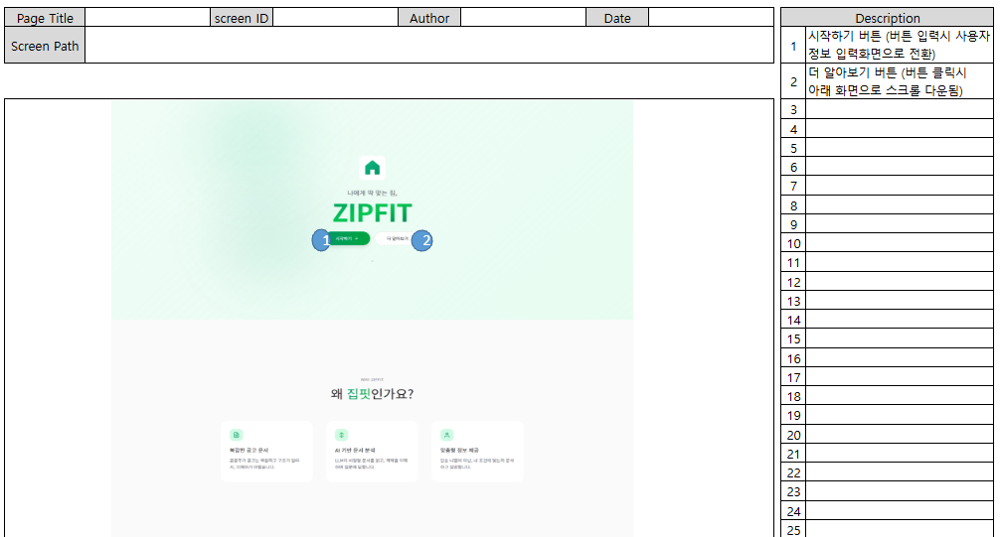
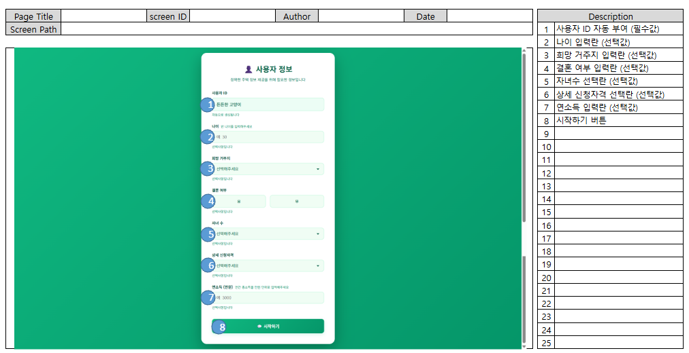
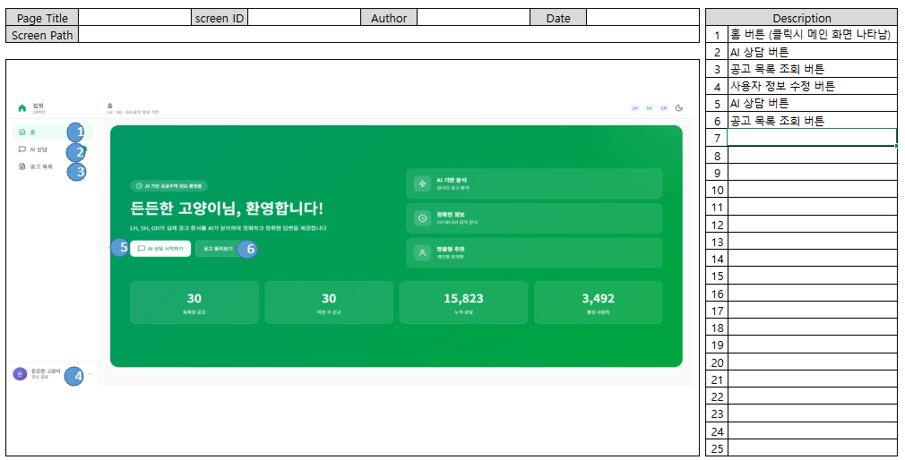
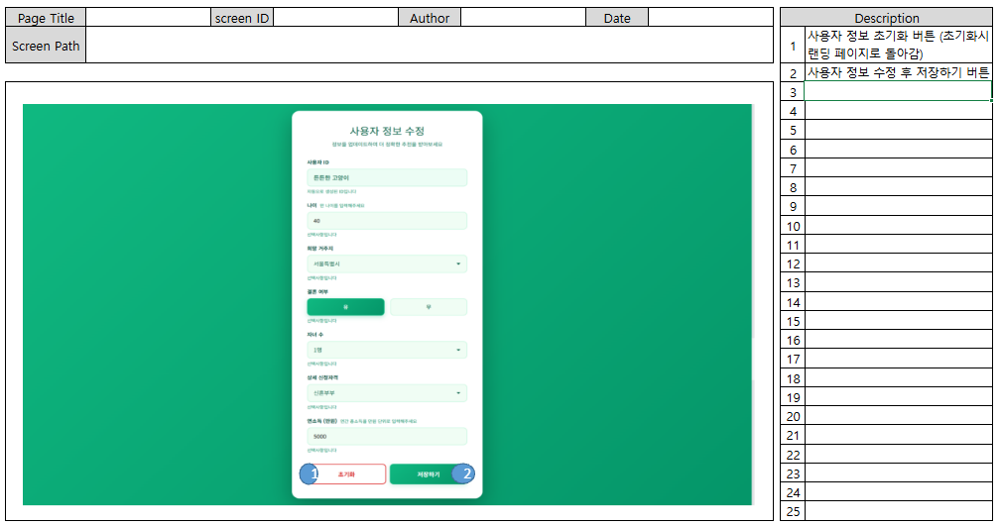
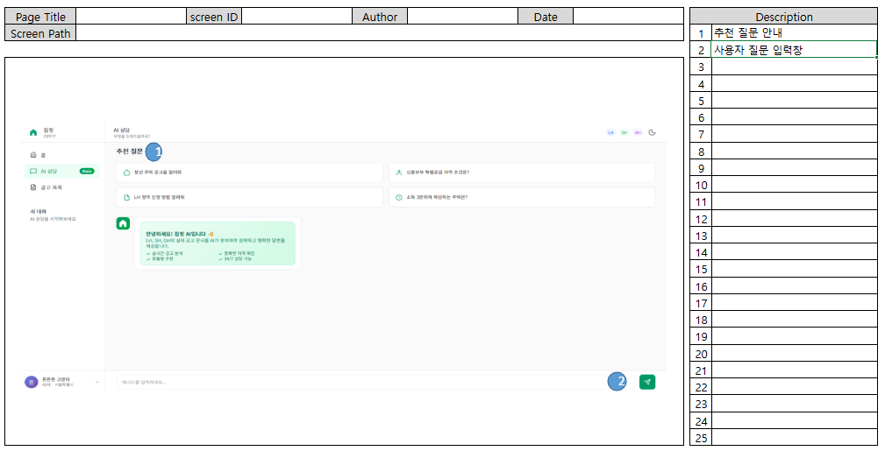

# 화면설계서

## 1. 화면 구성 개요

### 1.1 화면 목록

| 화면 ID | 화면명 | 파일명 | 설명 |
|---------|--------|--------|------|
| SC-001 | 랜딩 페이지 | landing.html | 서비스 소개 및 진입점 |
| SC-002 | 사용자 정보 입력 | user_info.html | 사용자 정보 입력 및 세션 생성 |
| SC-003 | 메인 대시보드 | main.html | 공고 통계 및 주요 기능 안내 |
| SC-004 | 사용자 정보 수정 | user_info_modify.html | 사용자 정보 조회 및 수정 |
| SC-005 | AI 상담 | chat.html | LangGraph 기반 챗봇 인터페이스 |
| SC-006 | 공고 목록 | list.html | 공고 목록 조회 및 필터링 |

### 1.2 화면 흐름도

```
[랜딩 페이지]
    ↓
[사용자 정보 입력]
    ↓
[메인 대시보드] ←→ [사용자 정보 수정]
    ├── [AI 상담]
    └── [공고 목록]
```

## 2. 화면 상세 설계

### 2.1 SC-001: 랜딩 페이지

**파일명**: `landing.html`

**목적**: 서비스 소개 및 사용자 유도

**화면 이미지**:



**주요 구성 요소**:

| 구성 요소 | 설명 |
|----------|------|
| 서비스 로고 및 타이틀 | ZIPFIT 브랜딩 |
| 서비스 소개 문구 | 프로젝트 소개 및 주요 기능 설명 |
| 주요 기능 안내 | AI 상담, 공고 목록 등 핵심 기능 소개 |
| 시작하기 버튼 | 사용자 정보 입력 페이지로 이동 |

**레이아웃**:

| 영역 | 구성 요소 |
|------|----------|
| 헤더 | 로고 및 네비게이션 |
| 메인 콘텐츠 | 서비스 소개 |
| 푸터 | 저작권 정보 |

**기능**:
- 시작하기 버튼 클릭 시 사용자 정보 입력 페이지로 이동

### 2.2 SC-002: 사용자 정보 입력

**파일명**: `user_info.html`

**목적**: 사용자 정보 입력 및 세션 생성

**화면 이미지**:



**주요 구성 요소**:

| 구성 요소 | 설명 |
|----------|------|
| 사용자 정보 입력 폼 | 나이(만), 희망 거주지, 혼인 상태, 자녀 유무, 연소득(만원) |
| 제출 버튼 | 사용자 정보 저장 및 메인 대시보드로 이동 |

**입력 항목**:

| 항목 | 타입 | 필수 여부 | 설명 |
|------|------|----------|------|
| 나이 | 숫자 | 선택 | 만 나이 |
| 희망 거주지 | 선택 | 선택 | 거주 희망 지역 |
| 혼인 상태 | 선택 | 선택 | 미혼/기혼 등 |
| 자녀 유무 | 선택 | 선택 | 자녀 보유 여부 |
| 연소득 | 숫자 | 선택 | 연소득 (만원 단위) |

**기능**:
- 사용자 정보 제출 시 세션 생성
- 사용자 ID 자동 생성 (25개 형용사 × 25개 동물 = 625가지 조합)
- 세션 ID를 쿠키 또는 로컬 스토리지에 저장
- 메인 대시보드로 이동

**제약사항**:
- 모든 필드는 선택사항 (익명 사용자 지원)

### 2.3 SC-003: 메인 대시보드

**파일명**: `main.html`

**목적**: 공고 통계 및 주요 기능 안내

**화면 이미지**:



**주요 구성 요소**:

| 구성 요소 | 설명 |
|----------|------|
| 공고 통계 카드 | 전체 공고 수, 접수 예정 공고, 접수 중인 공고, 기타 공고 |
| 주요 기능 링크 | AI 상담 시작, 공고 목록 보기 |

**레이아웃**:
- 헤더: 로고 및 네비게이션
- 사이드바: 메뉴 (선택사항)
- 메인 콘텐츠: 통계 및 기능 링크
- 푸터: 저작권 정보

**기능**:
- 공고 통계 API 호출하여 실시간 데이터 표시
- AI 상담 버튼 클릭 시 채팅 페이지로 이동
- 공고 목록 버튼 클릭 시 목록 페이지로 이동

**API 연동**:
- `GET /api/annc_summary`: 공고 통계 정보 조회

### 2.4 SC-004: 사용자 정보 수정

**파일명**: `user_info_modify.html`

**목적**: 사용자 정보 조회 및 수정

**화면 이미지**:



**주요 구성 요소**:

| 구성 요소 | 설명 |
|----------|------|
| 사용자 ID 표시 | 자동 생성된 사용자 ID (형용사 + 동물) |
| 사용자 정보 수정 폼 | 나이(만), 희망 거주지, 혼인 상태, 자녀 유무, 연소득(만원) |
| 저장 버튼 | 사용자 정보 저장 및 이전 페이지로 복귀 |
| 초기화 버튼 | 사용자 정보 초기화 및 랜딩 페이지로 이동 |

**입력 항목**:

| 항목 | 타입 | 필수 여부 | 설명 |
|------|------|----------|------|
| 나이 | 숫자 | 선택 | 만 나이 |
| 희망 거주지 | 선택 | 선택 | 거주 희망 지역 |
| 혼인 상태 | 선택 | 선택 | 미혼/기혼 등 |
| 자녀 유무 | 선택 | 선택 | 자녀 보유 여부 |
| 연소득 | 숫자 | 선택 | 연소득 (만원 단위) |

**레이아웃**:
- 헤더: 로고 및 네비게이션
- 메인 콘텐츠: 사용자 정보 수정 폼
- 푸터: 저작권 정보

**기능**:
- 저장된 사용자 정보 자동 로드 및 표시
- 사용자 정보 수정 및 저장
- 저장 완료 시 이전 페이지로 자동 복귀
- 초기화 시 사용자 정보 및 세션 데이터 완전 삭제 후 랜딩 페이지로 이동

**API 연동**:
- `GET /api/user_info`: 사용자 정보 조회
- `PUT /api/user_info`: 사용자 정보 수정
- `DELETE /api/user_info`: 사용자 정보 초기화 (세션 삭제)

**제약사항**:
- 모든 필드는 선택사항 (익명 사용자 지원)
- 사용자 ID는 수정 불가 (읽기 전용)

### 2.5 SC-005: AI 상담

**파일명**: `chat.html`

**목적**: LangGraph 기반 챗봇 인터페이스

**화면 이미지**:



**주요 구성 요소**:

| 영역 | 구성 요소 | 설명 |
|------|----------|------|
| 채팅 메시지 영역 | 사용자 메시지, 챗봇 응답, 로딩 인디케이터, 응답 생성 과정 표시 | 대화 내용 표시 |
| 입력 영역 | 텍스트 입력 필드, 전송 버튼 | 사용자 질의 입력 |
| 사이드바 | 대화 히스토리 (기존 채팅 목록), 관련 공고 목록 (참고 문서 노출) | 추가 정보 제공 |

**레이아웃**:
- 헤더: 로고 및 네비게이션
- 메인 콘텐츠: 채팅 인터페이스
- 입력 영역: 하단 고정

**기능**:

| 기능 | 설명 |
|------|------|
| 메시지 입력 및 전송 | Enter 키 또는 전송 버튼으로 질의 전송 |
| 챗봇 응답 표시 | LangGraph 기반 AI 응답 표시 |
| 응답 생성 과정 출력 | 진행 중인 프로세스 표시 (질의 분석 중, 검색 중, 답변 생성 중) |
| 질의 유형별 답변 반환 | 간단하고 명료한 출력 / 표 형식 제공 출력 / 상세한 내용 출력 |
| 참고 문서 노출 | AI 응답에 참고된 문서 3~5개 노출 |
| 대화 히스토리 관리 | 이전 대화 내용 유지 및 조회 |
| 관련 공고 정보 표시 | 검색된 공고 정보 표시 |
| 세션 관리 | 세션 생성, 유지, 초기화 |

**API 연동**:
- `POST /api/chat`: 채팅 메시지 전송 및 응답 수신

**상태 관리**:
- 세션 ID를 쿠키 또는 로컬 스토리지에 저장
- 대화 히스토리를 데이터베이스에 저장

### 2.6 SC-006: 공고 목록

**파일명**: `list.html`

**목적**: 공고 목록 조회 및 필터링

**화면 이미지**:


**주요 구성 요소**:
- 필터 영역
  - 검색바 (지역 또는 공고명 검색)
  - 기관 필터 (LH만 지원)
  - 유형 필터 (전체 유형 / 분양 / 임대)
  - 상태 필터 (공고중 / 접수중 / 마감 등)
  - 선택된 필터 표시 및 선택 해제 버튼
- 공고 목록 영역
  - 공고 카드 목록 (최대 10개 항목)
  - 무한 스크롤 (페이징 없이 스크롤 시 새로운 항목 조회)
- 검색 결과 정보
  - 총 공고 개수 표시

**레이아웃**:
- 헤더: 로고 및 네비게이션
- 사이드바: 필터 영역 및 최근 검색어
- 메인 콘텐츠: 공고 목록

**공고 카드 구성 요소**:

| 구성 요소 | 설명 |
|----------|------|
| 공사 정보 | LH |
| 공고 유형 | 예: 청년 행복주택, 국민임대 등 |
| 공고 제목 | 공고명 |
| 모집 일정 | 모집 시작일 - 모집 종료일 |
| 공고 상태 태그 | 공고중 / 접수중 / 접수중 D-N (접수 마감까지 남은 일수) / 마감 |
| 액션 버튼 | AI 상담하기: 해당 공고에 대한 AI 상담 페이지로 이동 (공고ID를 쿼리 파라미터로 전달)<br>공고문 웹 페이지: 원본 공고 페이지를 새 창으로 열기 |

**기능**:
- 최초 진입 시 '공고중' 상태의 공고 목록 자동 조회
- 검색바에서 지역 또는 공고명으로 검색
- 필터 조건에 따른 공고 목록 조회
  - 기관 필터 (LH만 지원)
  - 유형 필터 (분양 / 임대)
  - 상태 필터 (공고중 / 접수중 / 마감 등)
- 선택된 필터 표시 및 일괄 해제
- 무한 스크롤로 추가 공고 로드 (최대 10개씩)
- 공고 카드 클릭 시 해당 공고의 AI 상담 페이지로 이동
- 공고문 웹 페이지 버튼 클릭 시 원본 페이지 새 창 열기

**API 연동**:
- `GET /api/anncs`: 공고 목록 조회
  - 쿼리 파라미터: region, type, status, page, page_size

**제약사항**:
- 공고 목록은 최대 10개 항목까지 한 번에 노출
- 페이징 없이 스크롤 시 새로운 항목 조회

## 3. 공통 컴포넌트

### 3.1 사이드바 (Sidebar)

**위치**: main.html, chat.html, list.html, user_info_modify.html 공통

**구성 요소**:

| 구성 요소 | 설명 |
|----------|------|
| 로고 | 집핏 아이콘 및 텍스트 ("집핏 ZIPFIT"), 클릭 시 메인 대시보드로 이동 |
| 네비게이션 메뉴 | 홈, AI 상담, 공고 목록 메뉴 |
| 채팅 히스토리 | 이전 대화 목록 (제목으로 구성, 클릭 시 해당 채팅으로 이동) |
| 사용자 정보 | 사용자 ID 및 간단한 정보 표시, 클릭 시 사용자 정보 수정 페이지로 이동 |

**네비게이션 메뉴 상세**:

| 메뉴 항목 | 아이콘 | 동작 |
|----------|--------|------|
| 홈 | 집 아이콘 | 메인 대시보드로 이동 |
| AI 상담 | 채팅 아이콘 | 새로운 AI 상담 페이지로 이동 (공고 컨텍스트 초기화) |
| 공고 목록 | 문서 아이콘 | 공고 목록 페이지로 이동 |

**기능**:
- 로고 클릭 시 메인 대시보드로 이동
- 네비게이션 메뉴를 통한 페이지 간 이동
- 채팅 히스토리 조회 및 기존 대화 이동
- 사용자 정보 클릭 시 user_info_modify.html로 페이지 이동

**레이아웃**:
- 고정 너비: 256px
- 위치: 화면 왼쪽 고정
- 스크롤: 채팅 히스토리가 많을 경우 세로 스크롤 가능

**반응형**:
- 데스크톱 (> 1024px): 고정 사이드바
- 모바일 (< 1024px): 토글 가능한 오버레이 사이드바

### 3.2 헤더 (Header)

**위치**: main.html, chat.html, list.html 공통

**구성 요소**:

| 구성 요소 | 설명 |
|----------|------|
| 페이지 타이틀 | 현재 페이지 제목 (예: "홈", "AI 상담", "공고 목록") |
| 서브타이틀 | 페이지 설명 (예: "LH · SH · GH 공식 정보 기반") |
| 기관 배지 | LH, SH, GH 배지 표시 |

**레이아웃**:
- 위치: 메인 콘텐츠 상단
- 높이: 가변 (콘텐츠에 따라 조정)
- 배경: 투명 또는 흰색

### 3.3 푸터 (Footer)

**위치**: landing.html만 해당

**구성 요소**:
- 저작권 정보
- 기관 배지 (LH, SH, GH)

**참고**: 메인 대시보드, AI 상담, 공고 목록 페이지에는 푸터가 없음

### 3.4 모바일 네비게이션

**구성 요소**:

| 구성 요소 | 설명 |
|----------|------|
| 모바일 메뉴 토글 버튼 | 햄버거 메뉴 아이콘 (≡), 클릭 시 사이드바 열기/닫기 |
| 사이드바 오버레이 | 사이드바 열렸을 때 배경을 어둡게 처리, 클릭 시 사이드바 닫기 |

**기능**:
- 모바일 환경에서 사이드바 표시/숨김 토글
- 오버레이 클릭 시 사이드바 자동 닫기
- 터치 친화적인 버튼 크기 및 인터랙션

**표시 조건**:
- 화면 너비 < 1024px일 때만 모바일 메뉴 토글 버튼 표시
- 화면 너비 >= 1024px일 때는 사이드바 항상 고정 표시

### 3.5 로딩 인디케이터

**용도**: API 호출 중 로딩 상태 표시

**표시 위치**:
- 채팅 응답 대기 중
- 공고 목록 로딩 중
- 통계 데이터 로딩 중
- 사용자 정보 저장 중

**스타일**:
- 스피너 또는 스켈레톤 UI
- 적절한 로딩 메시지 표시

### 3.6 응답 생성 과정 표시

**용도**: AI 응답 생성 전 진행 중인 프로세스 표시 (채팅 전용)

**표시 내용**:
- 질의 분석 중
- 검색 중
- 답변 생성 중

**스타일**:
- 채팅 메시지 영역에 표시
- 진행 중인 단계를 시각적으로 강조
- 애니메이션 효과 (점 깜빡임 등)

## 4. 반응형 디자인

### 4.1 브레이크포인트

| 디바이스 | 화면 너비 | 레이아웃 |
|----------|----------|----------|
| 모바일 | < 768px | 단일 컬럼 |
| 태블릿 | 768px ~ 1024px | 2 컬럼 |
| 데스크톱 | > 1024px | 3 컬럼 |

### 4.2 모바일 최적화

- 터치 친화적인 버튼 크기
- 가로 스크롤 최소화
- 간결한 네비게이션

## 5. 참고 자료

- [프로젝트 산출물](./00_프로젝트_산출물.md)
- [요구사항 정의서](./01_요구사항_정의서.md)
