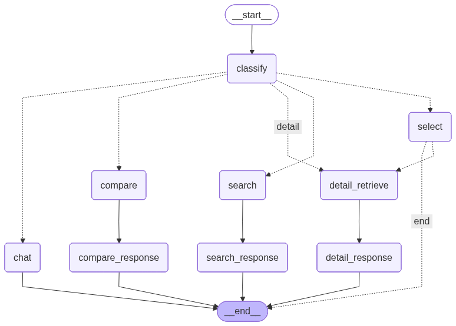

# 시스템 구성도

## 1. 전체 시스템 아키텍처

ZIPFIT은 Django 기반의 웹 애플리케이션으로, LangGraph 챗봇 엔진과 RAG 시스템을 통합하여 공공주택 공고 정보를 제공합니다.


**요청 처리 흐름:**
```
[사용자] → [Nginx] → [Gunicorn] → [Django]
                                      ├── Web (VIEW): HTML 렌더링
                                      └── Chatbot (REST API)
                                            ├── DB Handler → PostgreSQL
                                            ├── CHAT Handler → LangGraph
                                            └── LLM Handler → OpenAI API
```

| 구성요소 | 역할 |
|----------|------|
| **Nginx** | 리버스 프록시, HTTPS 처리, 정적 파일 서빙 |
| **Gunicorn** | WSGI 서버, Django 앱 실행 |
| **Django** | 웹 프레임워크, 비즈니스 로직 처리 |
| **DB Handler** | 공고 데이터 CRUD (PostgreSQL) |
| **CHAT Handler** | LangGraph 기반 대화 처리 |
| **LLM Handler** | OpenAI API 호출 (GPT-4o-mini) |

---

## 2. 데이터 수집 파이프라인

LH 공공주택 공고 데이터를 수집하고 처리하는 파이프라인입니다.


**처리 흐름:**
1. LH 청약센터에서 공고 목록 크롤링
2. PDF 공고문 다운로드 및 파싱 (LlamaParse, Camelot)
3. 텍스트 청킹 및 임베딩 생성 (OpenAI)
4. PostgreSQL + pgvector에 저장

---

## 3. RAG 파이프라인

사용자 질문에 대해 관련 문서를 검색하고 답변을 생성하는 파이프라인입니다.


**처리 흐름:**
1. 사용자 질문 → 의도 분류 (search/detail/compare/chat)
2. RDB 필터링 (지역, 유형, 상태)
3. 벡터 검색 (pgvector cosine similarity)
4. LLM 답변 생성 (GPT-4o-mini)

---

## 4. 기술 스택

| 구분 | 기술 | 버전 |
|------|------|------|
| **Backend** | Python | 3.12 |
| | Django | 6.0 |
| | Django REST Framework | 3.16.1 |
| **Frontend** | HTML5, CSS3, JavaScript | - |
| | Bootstrap | 5.x |
| **Database** | PostgreSQL | 14.20 |
| | pgvector | 0.4.2 |
| **AI/LLM** | OpenAI GPT-4o-mini | - |
| | LangGraph | 0.2.x |
| | LangChain | 0.3.x |
| **데이터 처리** | LlamaParse, Camelot, PyMuPDF | - |

---

## 5. LangGraph 그래프 구조



| 노드 | 기능 |
|------|------|
| `classify_intent` | 사용자 의도 분류 (search/select/detail/compare/chat) |
| `search` | 공고 검색 (RDB + RAG) |
| `select` | 공고 선택 (번호/공고명 기반) |
| `compare` | 공고 비교 (2개 이상) |
| `detail` | 상세 정보 조회 (RAG) |
| `chat` | 일반 대화 / 웹 검색 |

---

## 6. 데이터베이스 스키마

### 주요 테이블

| 테이블 | 설명 | 주요 컬럼 |
|--------|------|----------|
| `annc_all` | 공고 메타데이터 | annc_id, annc_title, annc_status, annc_region |
| `doc_chunks` | 문서 청크 | chunk_id, annc_id, content, embedding (vector) |
| `chat` | 채팅 세션 | session_key, user_key, title |
| `chat_message` | 채팅 메시지 | message, message_type, prompt (세션 상태 JSON) |

---

## 7. 배포 구성

| 구성요소 | 설명 |
|----------|------|
| **서버** | AWS Lightsail (Ubuntu) |
| **웹서버** | Nginx (리버스 프록시) |
| **WSGI** | Gunicorn |
| **DB** | AWS Lightsail (PostgreSQL) |
| **도메인** | HTTPS 적용 |

---

## 8. 외부 API 연동

| 서비스 | 용도 | 비고 |
|--------|------|------|
| **OpenAI API** | 임베딩 생성, LLM 답변 | text-embedding-3-small, gpt-4o-mini |
| **LlamaParse API** | PDF 문서 파싱 | 테이블 추출 |
| **Tavily API** | 웹 검색 | 최신 정보 검색 (선택적) |

---

## 9. 참고 자료

- [프로젝트 산출물](./00_프로젝트_산출물.md)
- [요구사항 정의서](./01_요구사항_정의서.md)

